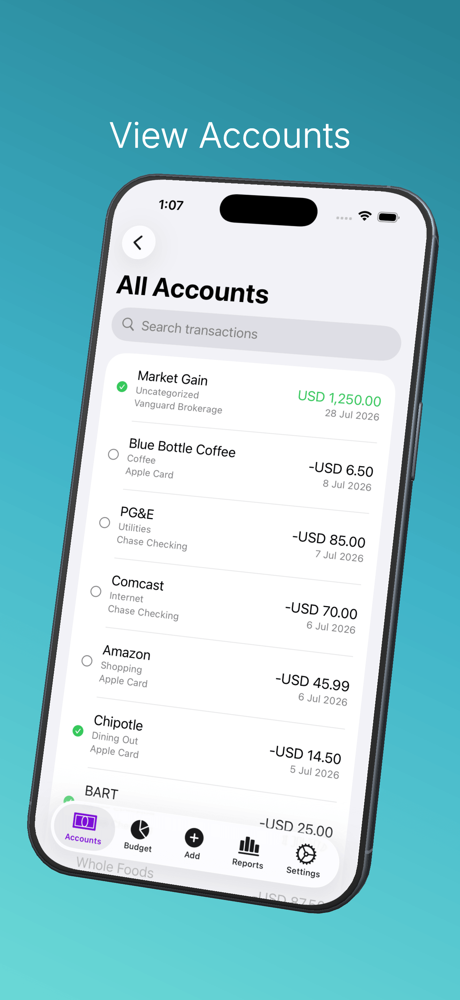
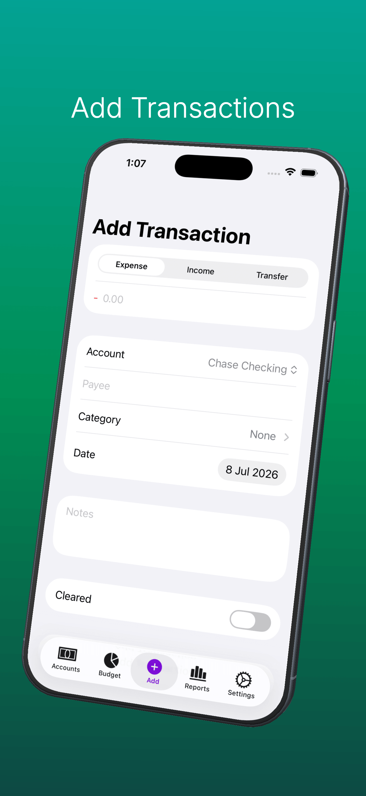
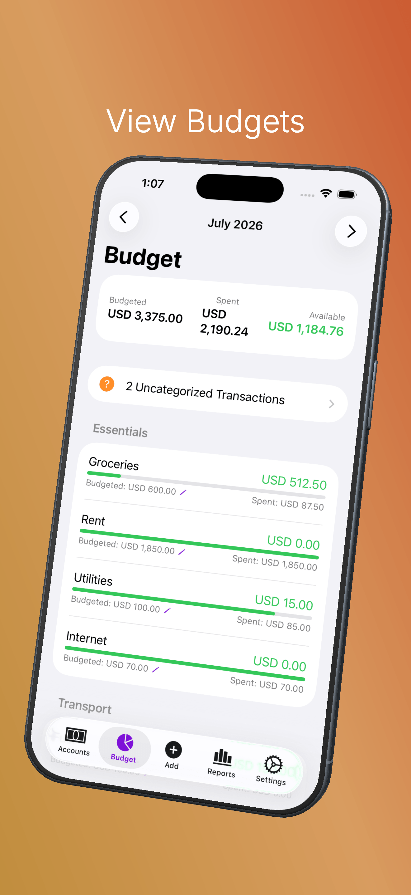
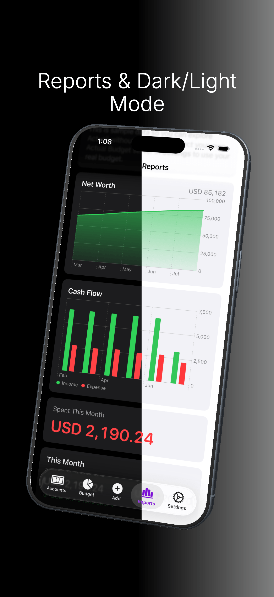

# Actuali

A native iOS companion app for [Actual Budget](https://actualbudget.org/), the local-first personal finance tool. Actuali talks directly to your self-hosted Actual server using the same CRDT sync protocol as Actual's own clients, so it works offline and merges cleanly with edits made anywhere else.

This is an unofficial community project. It is not affiliated with or endorsed by the Actual Budget team.

Website: [actuali.mfazz.com](https://actuali.mfazz.com)

## Screenshots

| Accounts | Add Transactions | Budget | Reports |
|-|-|-|-|
|  |  |  |  |

## Features

- Accounts: net worth and balances grouped by on-budget and off-budget, plus a combined All Accounts view
- Transactions: browse your full history or a single account; search by payee, category, notes, or amount; add expenses, deposits, and transfers; swipe to edit or delete
- Smart payees: autocomplete from existing payees, category auto-fill from payee history, nearby payee suggestions based on location, and automatic cleanup of Apple Pay-style merchant strings
- Rules: your Actual Budget rules run on transactions logged from the app and from Shortcuts, just like on desktop
- Budget: category-by-category budgeted vs. spent with progress bars, month-to-month carryover, in-app editing of budgeted amounts, and an uncategorized-transactions view
- Reports: renders the dashboard you configured in the Actual webapp — Net Worth, Cash Flow, Spending, and Summary widgets with real data
- iOS Shortcuts: a "Log Transaction" intent for Siri, widgets, and automations — amounts work even when passed as text, and a failed background log posts a notification that opens a prefilled form. Pairs with the [Apple Wallet automation guide](https://actuali.mfazz.com/guides/wallet-automation) to log Apple Pay purchases as you make them
- Demo budget: explore the whole app with realistic sample data, no server required
- Sign in with password or **OpenID Connect / OAuth** — the app detects which methods your server offers
- Offline-first: every budget lives locally in SQLite; changes sync back automatically via Actual's CRDT protocol
- **Light & dark mode**
- No analytics, no third-party tracking. The app talks only to the Actual server you configure.

## Requirements

- A self-hosted [Actual Budget server](https://actualbudget.org/docs/install/) you can reach from your phone
- iOS 26.1 or later

## Install

Actuali is available on the App Store: [download Actuali](https://apps.apple.com/app/actuali/id6764063765).

Want early access to beta builds? [Join the TestFlight](https://testflight.apple.com/join/NsYntuXB).

## Building from source

You'll need Xcode with the iOS 26.1+ SDK. Dependencies (GRDB.swift, SwiftProtobuf, ZIPFoundation) are managed by Xcode's Swift Package Manager and resolve on first build.

```bash
# Open in Xcode
open Actuali/Actuali.xcodeproj

# Or build from the command line
xcodebuild -project Actuali/Actuali.xcodeproj -scheme Actuali -sdk iphonesimulator build

# Regenerate protobuf code (only if sync.proto changes)
protoc --swift_out=Actuali/Actuali/Generated/ Actuali/Actuali/Resources/sync.proto
```

## Architecture

```
UI (SwiftUI Views)
    ↓
BudgetStore (@MainActor, ObservableObject)
    ↓
Services Layer
├── BudgetDatabase (GRDB) → SQLite
├── SyncClient (actor) → CRDT sync engine
└── ActualServerClient (actor) → Network
```

The sync engine (`Actuali/Actuali/Services/Sync/`) implements Actual's CRDT protocol: a hybrid logical clock for causality ordering, a Merkle tree for efficient diffing, field-level CRDT messages, and protobuf encoding. Writes go to local SQLite first, generate CRDT messages, and sync to the server with a short debounce; reads are plain SQLite queries.

## Relationship to Actual Budget

Actuali is a companion client, not a fork or replacement. It requires an Actual server and stores nothing anywhere else. The sync engine is a Swift port of Actual's CRDT implementation (`packages/crdt` and `packages/loot-core` in the [upstream repo](https://github.com/actualbudget/actual)), which is MIT-licensed — see [LICENSE](LICENSE) for the attribution notice. For development, the upstream repo can be cloned into `actual/` (gitignored) as a reference implementation.

## Contributing

See [CONTRIBUTING.md](CONTRIBUTING.md).

## License

MIT — see [LICENSE](LICENSE). Portions ported from Actual Budget (MIT, copyright James Long).
